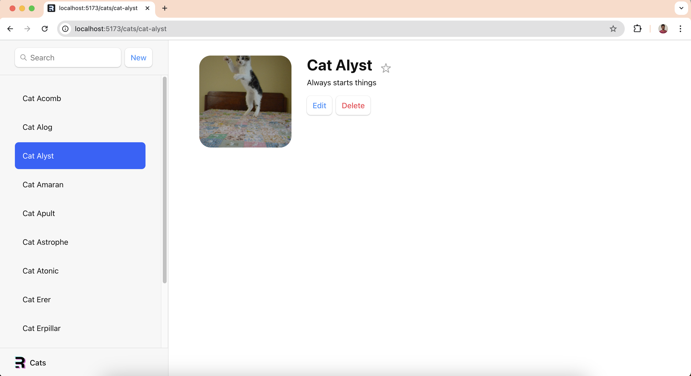

# Cat App



It's an app with a bunch of cats! But it can teach you how to use the Remix framework.

## Development

From the terminal:

```sh
npm run dev
```

This starts the app in development mode, rebuilding assets on file changes.

## Deployment

First, build the app for production:

```sh
npm run build
```

Then run the app in production mode:

```sh
npm start
```

# Learn Remix!

- [Remix Docs](https://remix.run/docs)
- [Remix Tutorial](https://remix.run/docs/en/main/start/tutorial)
